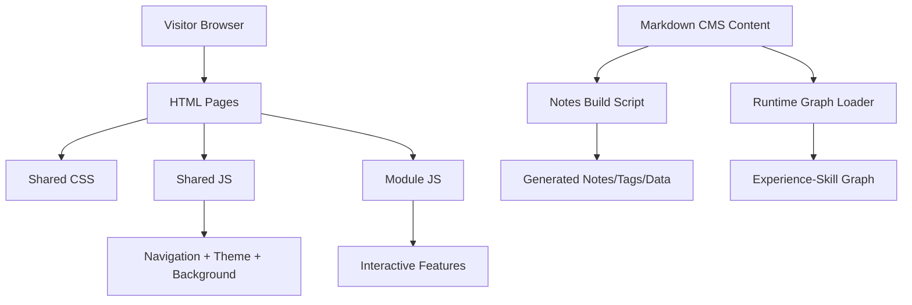

# Site Architecture Overview

This is a practical map of how the site works.

In simple terms:
- HTML files are the rooms people visit.
- CSS controls visual style and layout.
- JavaScript adds behavior and interactivity.
- Markdown content files are the editable source for notes and the experience-skill graph.

For detail views, see:
- [[pages-and-navigation]]
- [[runtime-javascript]]
- [[cms-content-model]]

## Big picture

## Core directories at a glance

- `modules/` interactive module pages
- `notes/`, `tags/`, `data/` generated static output
- `content/notes/` source notes markdown
- `content/graph-data/` source graph markdown
- `js/` shared site JavaScript
- root `gc-*.js` core simulation and visualization logic used by module 03

## Why this structure is useful

- Keeps content editable as Markdown.
- Keeps runtime lightweight (plain HTML/CSS/JS, no framework runtime).
- Makes it easy to add pages while reusing shared navigation, theme, and footer behavior.

## Future site integration (when you are ready)

- Option A: publish this as a standalone architecture page using slug `architecture-overview`.
- Option B: keep this as a note and add a link from Site Notes (`/colophon/`) to the architecture page.
- Keep these linked files (`[[...]]`) as source notes so diagrams and relationships remain visible in Obsidian.
