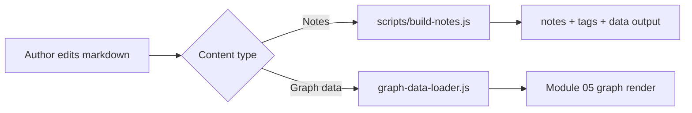

# CMS and Content Model

Back to: [[architecture-overview]]

## Two content pipelines

### 1) Notes pipeline (build step)

Editable source:
- `content/notes/published/*.md`
- `content/notes/drafts/*.md`

Build script:
- `scripts/build-notes.js`

Generated output:
- `notes/`
- `tags/`
- `data/notes-index.json`
- `data/tags-index.json`

### 2) Experience-skill graph pipeline (runtime loading)

Editable source:
- `content/graph-data/experience-skill-graph.md`

Runtime loader:
- `modules/experience-skill-graph/graph-data-loader.js`

Rendered page:
- `modules/experience-skill-graph/index.html`

## Why this split works

- Notes benefit from static generation for fast listing and tag pages.
- Graph content benefits from direct runtime loading, so updates stay in one markdown source file.

## Content flow map

## Future-proofing hints

- Keep frontmatter fields consistent (`title`, `slug`, `date`, `status`, `summary`, `tags`).
- Keep IDs stable in graph data rows so links do not break.
- Prefer additive changes over renaming IDs where possible.
- If this should be published on-site later, reuse this content and render it as an architecture page with slug `architecture-overview`.
