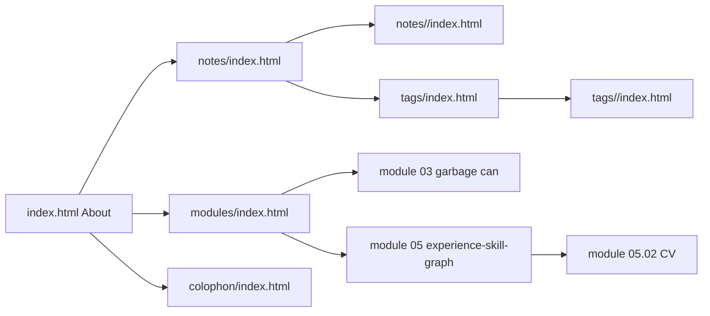

# Pages and Navigation

This note explains where the main pages live and what is shared across them.

Back to: [[architecture-overview]]

## Main page groups

- `index.html` About / home
- `modules/` interactive modules
- `notes/` generated notes index and detail pages
- `tags/` generated tag index and tag pages
- `colophon/` site notes

## Shared shell pattern

Most pages include the same top-level pattern:
- top navigation bar
- main content area
- footer
- `js/nav-controller.js` for mobile nav behavior (and global footer social links)

## Page map

## Important implementation detail

Some pages are generated (notes/tags) while others are hand-authored (modules/home/colophon). This mixed model is intentional and keeps authored content flexible.
