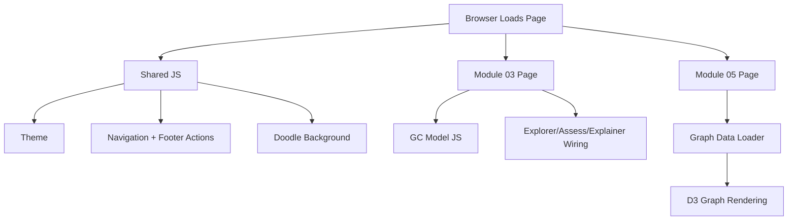

# Runtime JavaScript Map

Back to: [[architecture-overview]]

## Shared runtime scripts

- `js/theme-bootstrap.js` applies the selected theme early.
- `js/nav-controller.js` handles mobile nav and site-wide footer social links.
- `js/doodle-background.js` adds decorative background doodles on selected pages.

## Module 03 runtime (Garbage Can)

Core model and visualization logic currently live in root JS files:
- `gc-simulation-config.js`
- `gc-simulation-core.js`
- `gc-simulation.js`
- `gc-scoring.js`
- `gc-diagnosis.js`
- `gc-viz-config.js`
- `gc-viz-timing.js`
- `gc-viz-helpers.js`
- `gc-viz.js`

Module-specific wiring:
- `modules/garbage-can/explorer/explorer.js`
- `modules/garbage-can/assess/assess.js`
- `modules/garbage-can/can-explainer/can-explainer.js`

## Module 05 runtime (Experience-Skill Graph)

- `modules/experience-skill-graph/index.html` hosts the D3 force graph.
- `modules/experience-skill-graph/graph-data-loader.js` loads and parses graph CMS markdown.

## Runtime relationship map

